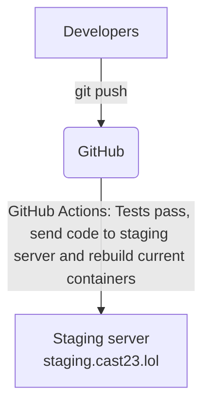
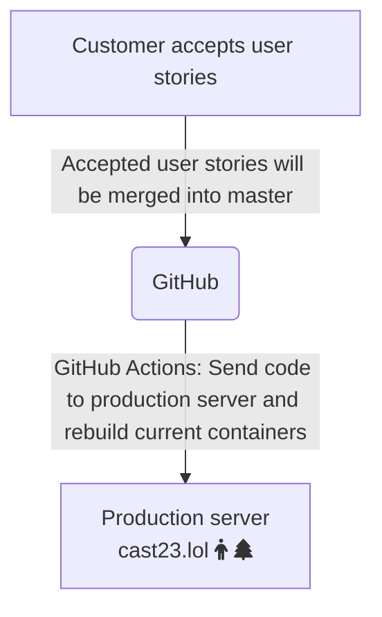

# CI/CD Pipeline

<!--
See the official documentation for syntax
https://mermaid.js.org
-->

### CI

```mermaid
graph TD
    A[Developers] -->|git push| B(GitHub)
    B -->|GitHub Actions: Tests pass, send code to staging server and rebuild current containers| C[Staging server \n staging.cast23.lol]
```

### CD

```mermaid
graph TD    
    A[Customer accepts user stories] -->|Accepted user stories will be merged into master| B(GitHub)
    B -->|GitHub Actions: Send code to production server and rebuild current containers| C[Production server \n cast23.lol fa:fa-person fa:fa-tree]
```
