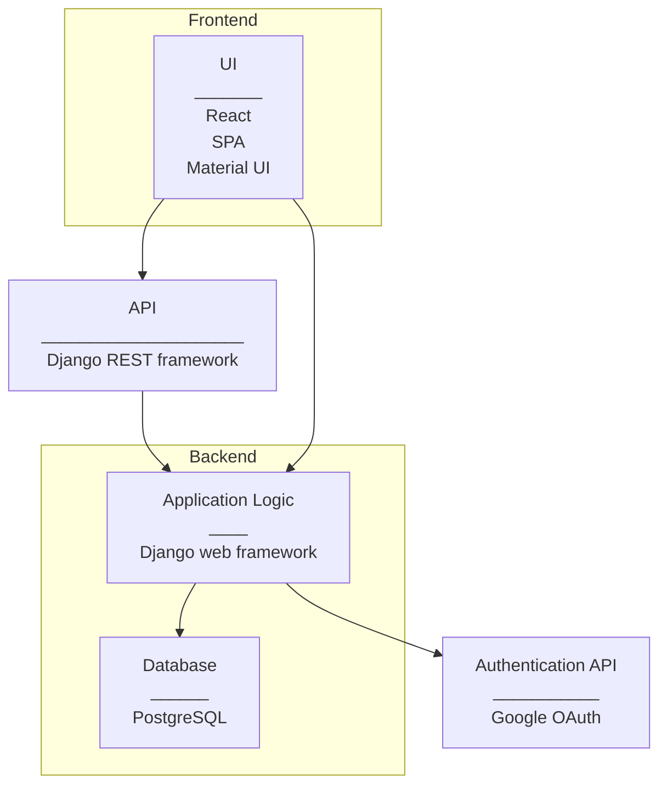

# Application Architecture

## Overview

**Frontend**

- Implemented in React
  - Single Page Application design style
  - Material UI: React Component library for styling web content

**API**

- API: Django REST framework
- API routes: see [API documentation](rest_api.md)

**Backend**

- Implemented in Python 
- Django web framework

**Database**

- PostgreSQL
- [Database architecture](cast_db-architecture.md)

**Authentication (OAuth)**

- Google OAuth: OAuth 2.0 protocol

**CI/CD pipeline**

- [Architecture](CICD_pipeline.md)

**Testing**

- Tested using Robot Framework with Selenium library
- [Testing guide](testing-details-and-instructions.md)

