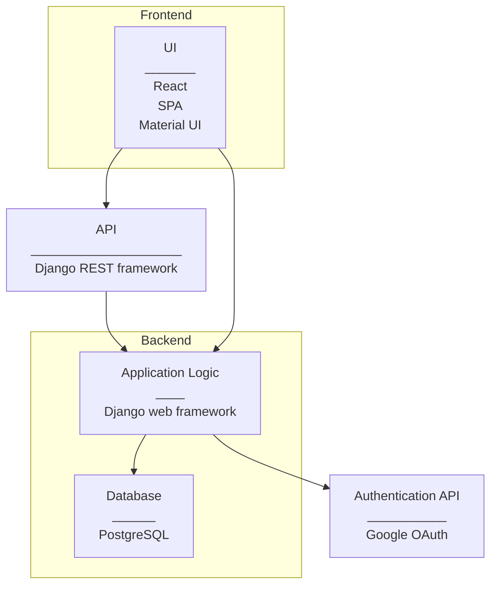

# Application Architecture

## Overview

**UI**

- React Application
  - Single Page Application design style
  - Material UI: React Component library for styling web content

**API**

- API: Django REST framework

**Django**

- Django: Python web framework
  - Implement Model from Django MVT

**Database**

- PostgreSQL

**Authentication (OAuth)**

- Google OAuth: OAuth 2.0 protocol

**CI/CD pipeline**

## Initial proposal for API-routes

- all/
- consult/name
- certs/?certification=cert1,cert2, cert3
- skills/?skill=skill1,skill2,skill3
- project-startdate/
- allocation/

Questions:

- What if client wants to filter consults with?
  - certain certifications
  - certain skills
  - certain allocation

Other notes

- Certifications and Skills from Database through API?
