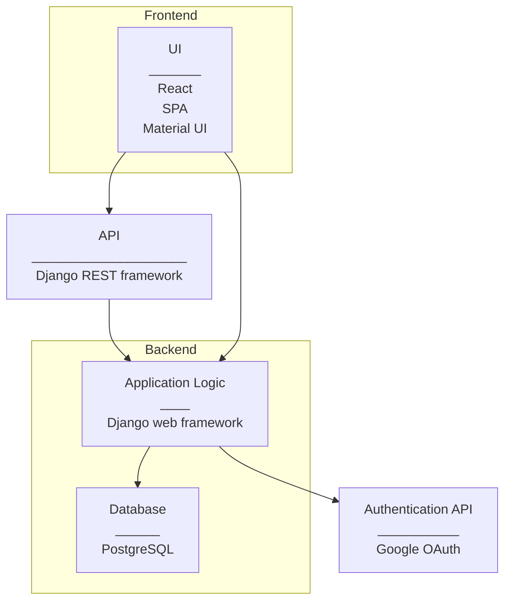

# Application Architecture

## Overview

**Frontend**

- Implemented in React
  - Single Page Application design style
  - Material UI: React Component library for styling web content

**API**

- API: Django REST framework
- API routes:
   - all/
   - consult/name
   - certs/?certification=cert1,cert2, cert3
   - skills/?skill=skill1,skill2,skill3
   - project-startdate/
   - allocation/

**Backend**

- Implemented in Python 
- Django web framework
  - Implement Model from Django MVT

**Database**

- PostgreSQL
- [Database architecture](https://github.com/Cast2023/cast/blob/documentation/documentation/cast_db-architecture.md)

**Authentication (OAuth)**

- Google OAuth: OAuth 2.0 protocol

**CI/CD pipeline**

- [Architecture](https://github.com/Cast2023/cast/blob/documentation/documentation/CICD_pipeline.md)

**Testing**

- Tested using Robot Framework with Selenium library
- [Testing guide](https://github.com/Cast2023/cast/blob/documentation/documentation/testing-details-and-instructions.md)

