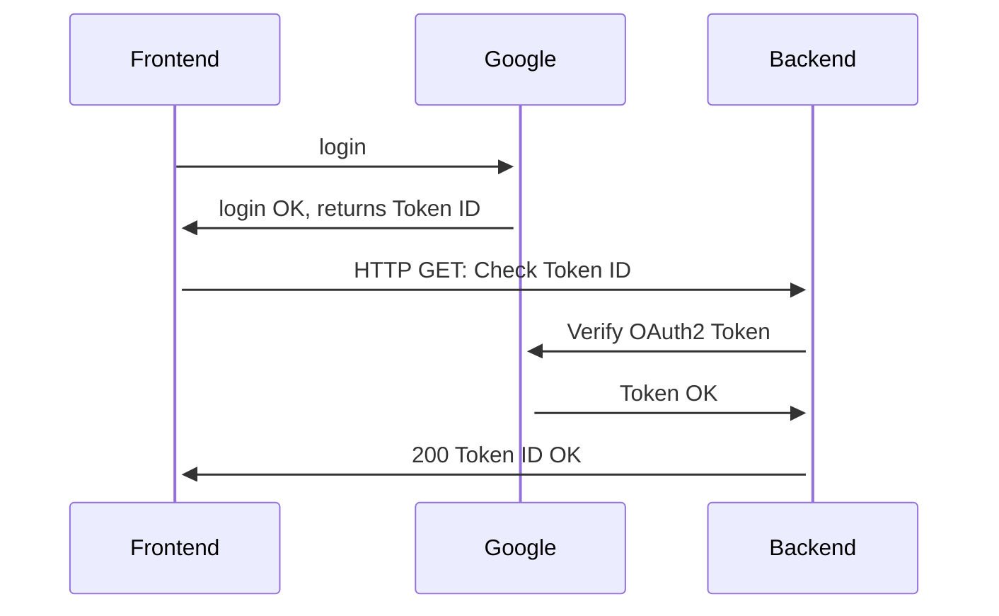

## Google OAuth login in CAST

Frontend provides Google login button in UI as a component:

```javascript
<GoogleLogin
    onSuccess={credentialResponse => {
        successCallback(credentialResponse)
    }}
/>

```

There have been defined a function which is called when the login event success and it will get response data forwarded into credentialResponse variable, which is given as a parameter to successCallback function.

```javascript
const successCallback = (response) => {
  axios.get(process.env.REACT_APP_BACKEND_URL, {
    headers: {
      'Content-Type': 'application/json',
      Authorization: JSON.stringify(response.credential)
    }
  })
}
```

The successCallback function takes the response data (Token ID object) as parameter and takes the credential part of it and puts it into header's Authorization field as a value. With the composed header axios will create a HTTP GET request to the address that is defined in .env file, e.g. *http://localhost:8000/api/verify-google-token*.

Additionally the App itself should be wrapped with GoogleOAuthProvider in *index.js*:

```javascript
<GoogleOAuthProvider clientId={ process.env.REACT_APP_GOOGLE_CLIENT_ID }>
    <App />
</GoogleOAuthProvider>
```

It reads the client ID value from .env file.

Frontend uses [React OAuth2 | Google](https://www.npmjs.com/package/@react-oauth/google) library, see the documentation for more spesific information.

Backend needs the client ID as well from .env file and it imports it from the *settings.py*. The token will be parsed from header's Authorization field and additional quotes will be stripped off. Then Google's own methods does the verifying with *token* and *client ID*, and returns ValueError if everything is not allright. Otherwise the response with status code 200 can be sent and if there are something else wrong, the 401 will be sent.

```python
class VerifyOAuthTokenApi(APIView):
    def get(self, request):
        CLIENT_ID = settings.ENV["OAUTH_CLIENT_ID"]

        try:
            token = request.headers.get("Authorization").strip("\"")

            try:
                id_token.verify_oauth2_token(token, requests.Request(), CLIENT_ID)

            except ValueError:
                return Response("Invalid token, you shall not pass!", status=401) # Token invalid

            return Response("Just keep swimming.", status=200) # Token OK

        except Exception:
            return Response("Error: Not authorized", status=401) # Something else is wrong
```

Flowchart which represents the event described above:



